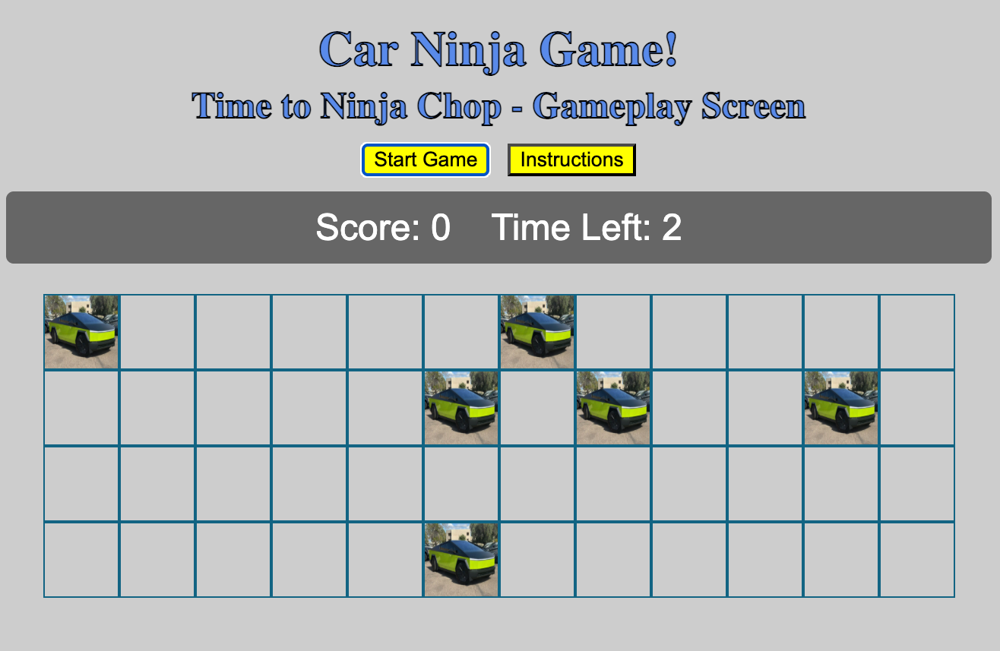
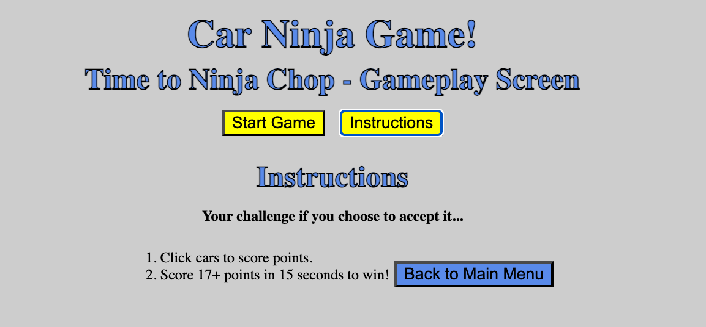

# Car Ninja!

Ready to ninja chop some cars??!? Have all the cars around you been driving too slowly in the fast lane, lately? And you're done with it?! If so, Car Ninja is for you!

## Screenshot of Car Ninja App with Instructions

## Disclaimer
*Car Ninja is an educational project inspired by Fruit Ninja, created solely for learning purposes. All assets are used under fair use for academic demonstration.... In addition, this is from a ninja-movie-watching-fan!*

## Description & Background Info
Car Ninja was originally inspired by the game Fruit Ninja! I had big plans to create something almost identical to Fruit Ninja; except instead of slicing fruit, you'd be clicking on cars and watching them break apart!

Background Info: I chose to create this game because (1) Fruit Ninja is FUN! Who doesn't like to slice random fruit and see it splat everywhere, without the real-life cleanup?! And (2) I wanted to create a game that is similar but with cars because when I drive in the United States, the drivers are horrible and they like to drive slowly in the fast lanes, and also don't abide by driving rules. I thought it would be fun to create a game where you could "slice" a car that's a poor driver (since you can't do it in real life. hehe). I figure this new rendition could be the solution for "road rage". Just play Car Ninja, and you won't want to do crazy things on the real road! lol

Ultimately, in its current iteration, it is purely a game in which you click on cars to score points. You have 15 seconds to click on 17 cars to win! Otherwise, you lose. It is very similar to Whackamole except cybertrucks are randomly generated and you click on them. Due to the fact that I'm a beginner coder, this is the best I can do at this point. I, however, still plan on continuing my quest to create this game exactly as I intended with rogue potholes (to lose lives), sound effects, random comic-strip-looking word bubbles that come from the cars, and funny comments generated by a ninja and by the cars.

## Getting Started

### Deployed Game: wait for it... wait for it...
*(We will be creating the deployed link on Project Presentations Day)*

## Instructions: 
- (1) Click on "Start Game" Button to commence the game. 
- (2) Click cars to score points.
- (3) Score 17+ points in 15 seconds to win!

## My Planning Materials including Proposal, User Stories, and Pseudocode:
Excalidraw Proposal Rendering: https://excalidraw.com/#json=sC5spph5Pl5N-gakOGVoD,z0pOg97SMsKWoaxYUjVtcA

Link to my planning materials: https://excalidraw.com/#json=sC5spph5Pl5N-gakOGVoD,z0pOg97SMsKWoaxYUjVtcA

## User Stories:
- As a player, I want cars to appear in a grid so that I can interact with them visually.
- As a player, I want to click on slow cars so that I can earn points and feel rewarded.
- As a player, I want slow cars to break apart when clicked so that it feels like I sliced them.
- As a player, I want a ninja sound to play when I slice a car so that the game feels more fun and dramatic.
- As a player, I want my score to go up when I slice a slow car so that I can track my success.
- As a player, I want the game to subtract points if I click the wrong car so that I’m challenged to pay attention.
- As a player, I want to lose points if I don’t click a slow car in time so that I feel urgency to act.
- As a player, I want some cars to shout funny or rude insults so that the game has personality and makes me laugh.
- As a player, I want those insults to appear in speech bubbles so that it feels like a cartoon scene.
- As a player, I want to see my score update immediately so that I always know how I’m doing.
- As a player, I want to know when the game is over so that I can stop playing and see my final score.
- As a player, I want to see a “Game Over” screen with my score so that I can feel a sense of completion.
- As a player, I want some cars to spin or wiggle so that it’s harder to click them.
- As a player, I want to see visual feedback when I click something wrong so I know I made a mistake.
- As a player, I want the game to get harder over time so that I stay engaged.
- As a player, I want the game to give me positive messages when I score well so I feel encouraged.
- As a player, I want the game to include accessibility features so I can play no matter my abilities.

## Pseudocode:
## Pseudocode Developer Tasks 

### Initial proposal Idea that I sent to Tristan that he ok'd 
"I just thought of a fun idea. I could do a take off of "Fruit Ninja" and instead do a
simple "Car Ninja" game where I use a grid and the cars move... but if a car is
moving too slowly, I can chop it /click it to get it out of the way. I think it could be
simple enough and work. Instead of fruit, I'd be chopping cars. If this idea sounds
good for my level, I'll make a trello and then submit it. Just wanted to make sure
I'm on the right track."

## After researching online, here's kind of a basic format:
- For a Simple Web Version I could make a beginner version like this:
- Fruit/aka Cars (images or colored circles) appear on screen.
- You click the car to “slice” it before it disappears.
- Add a “splat” effect and a score.
- Bonus: some “bombs”/"potholes" you shouldn’t click!
- I don’t need real swiping — clicking is enough to capture the feel. I just
substitute cars for fruit.

## Pseudocode Delineated Below:
### Basic SetUp
1. Design the game grid layout using HTML/CSS/Flexbox. (html, css)
2. Create a "score display" area on the screen - to update the score. (html using
a div element / css custom font, size, color, position / js updates the number
in live format based on user actions.)
• Always visible in the corner (usually top right) (html, css, flexbox)
• Updates instantly when the player clicks/slices the car. (js)
• If possible, style with a custom font or glowing effect to match the game
theme. (css)
3. Create another "___ tries left" with "score display" or a button? (html, css, js)
4. Add "Instructions" button. (html)
5. Add "Start Game" button. (html)
6. After "Start Game" button is pressed, have screen do "Ready...go!" (kind of
like a count down)
7. Add "Game Over" button, that when pressed resets and goes back to the
beginning where you can play again. / Maybe show a "Game Over" screen
with the final score and a restart options (html, css, js)
8. Create a condition to end the game (e.g. time runs out, score limit, or used up
all your click/slice tries/amounts) (js)
9. Add an area of "fun facts" about these cars. Fruit ninja has a fun fact section
right after Game Over.
10. Add a home screen option/image/link to go back to home screen.
Car Generation & Appearance
11. Download some different images of diverse cars - Cybertruck, Ferrari, Toyota
(html)
12. Assign a type label to each car so users can tell what kind it is (html, css,
maybe js)
13. Set up different car types: slow, fast, spinning, wiggling (js)
14. Apply different styles or animations to make cars look unique (eg., wiggle,
spin) (css and animations)
15. Create a function to spawn car elements in random grid cells / Either that or
just have cars move from bottom to top of screen at various speeds, and after
they are clicked have them somehow disappear or break apart. (js)
16. Create random potholes to pop up, in place of cars. Lose points if you click
on them.
Interactions
17. Add click handling so players can click cars (js)
18. Determine what happens when a slow car is clicked (sound, score, slice -
maybe explosion sound or ninja sound, score goes up by a certain amount of
points, somehow break car apart?) (js)
19. Determine what happens when a wrong car is clicked (penalty, warning) (js)
20. Prevent the same car from being clicked twice (js)
Timing & Game Loop
21. Set up a timer that spawns cars every few seconds/or starts cars every few
seconds (js)
22. Set a 30-second timeout per car — if it’s not clicked, subtract points and
remove it (js)
23. Create a setTimeout() and clearTimeout() - keep track of all active timeouts
so can clear them if needed. This keeps track of it & lets me stop scheduled
actions if something changes (like navigating away, resetting a form, etc.). (js)
Score Management
24. Create functions to increase or decrease the score (js)
25. Update the score display in real time (js)
Slice Animation & Sound
26. Design the slice effect: breaking the car into halves and animating them
apart (css, js) / I want to do this with the click of a button. Not sure if I will
actually be able to make car break apart.
27. Play a ninja sound effect when the slice/click happens (html, js)
28. Remove the broken pieces after animation ends, or have a splat at the
side of the road (js)
Insults & Speech Bubbles
29. Create a list of insults the cars can say (js)
30. Randomly trigger insults on certain cars after a short delay (js)
31. Display insults in styled speech bubbles next to the car (html, css, js)
32. Remove the speech bubble after a few seconds (js)
End Game (Optional)
33. Create a condition to end the game (e.g., time runs out, score limit, or
mistake count) (js)
34. Show a “Game Over” screen with the final score and a restart option (html,
css, js)
### LEVEL UP STUFF:
add some stuff from creating websites

## Learning Resources (Attributions)
- Game inspiration: Fruit Ninja by Halfbrick Studios
- Research: [MDN Web Docs](https://developer.mozilla.org/) (for questions about what things mean, correct syntax)
- Tutorials: [w3schools](https://www.w3schools.com/)
- Courses: [Udemy](https://www.udemy.com/)
- Video Guides: [YouTube](https://youtube.com)
- AI Search Engines: ChatGPT, DeepSeek, Grok (for questions about what things mean, correct syntax & debugging help)
- Image Search: Google Images & Photos Generated by myself (for reference only)
- Addtl Image Resource: Auto Trader
- Cybertruck image: [AutoTrader](https://images.autotrader.com/xyz.jpg)
- Image Link: https://images.autotrader.com/scaler/408/306/hn/c/03775bd69037404893e710eea5872111.jpg
- Font: [Google Fonts](https://fonts.google.com/) (I will be using these in the future when I update the game!)
- Sound effects: [Source Name](link) *(I will be using these in the future when I update the game!)*

## Technologies Used: 
- HTML5
- CSS3
- JavaScript (ES6)
- Git/GitHub

## Planned future enhancements (stretch goals):
- Add sound effects on click.
- Pothole obstacles.
- Implement losing lives and/or score penalties for missed cars or clicking on potholes.
- Funny insult bubbles generated by cars while they are driving.
- Add slicing animation - expanding on the game and creating a full slice rather than just a click.
- More animations.
- More sound effects for many other areas.
- More backdrops including different locations.
- A fuller variety of cars.
- The ability to be different characters as you play.
- Create a level up system / aka some type of progression system
- If time, add sections including: Features, Screenshot/Images/Visuals Descriptions, Early Concept/Ideas, Process aka Build/CodeProcess, Known Issues & Bug Solves, Edge Cases Covered.

## Ahas & Awarenesses from this project while researching code, coding, and fixing bugs

CONSISTENT TEXT - In my data.js section, inside Objects, using consistent text for the "key" in key: value pairs was especially eye opening for me, regarding ease of use later on in coding... Especially in JS iterating over arrays and objects (e.g. forEach, for...loop). Creating consistent text makes code more reusable and easier to maintain.

Example: 

MY INITIAL VERSION:
const carComments = [
    { comment1: "Oh noooo! I was driving to slow!" },//AI is saying I need consistent keys here and to name them all "text"/ask about this
    { comment2: "" },
    { comment3: "" },
    { comment4: "" },
    { comment5: "" } //Took off trailing comment here. Even though comma works with modern JS, doesn't work for older environments.
];

CORRECTED VERSION FOR MORE USEABILITY:
const carComments = [
    { text: "Oh noooo! I was driving to slow!" },//AI is saying I need consistent keys here and to name them all "text"/ask about this
    { text: "" },
    { text: "" },
    { text: "" },
    { text: "" } //Took off trailing comment here. Even though comma works with modern JS, doesn't work for older environments.
];

## Known Issues
- Mobile responsiveness needs improvement
- Sound effects not yet implemented
- Animation not yet implemented
- I would like to add many more features.